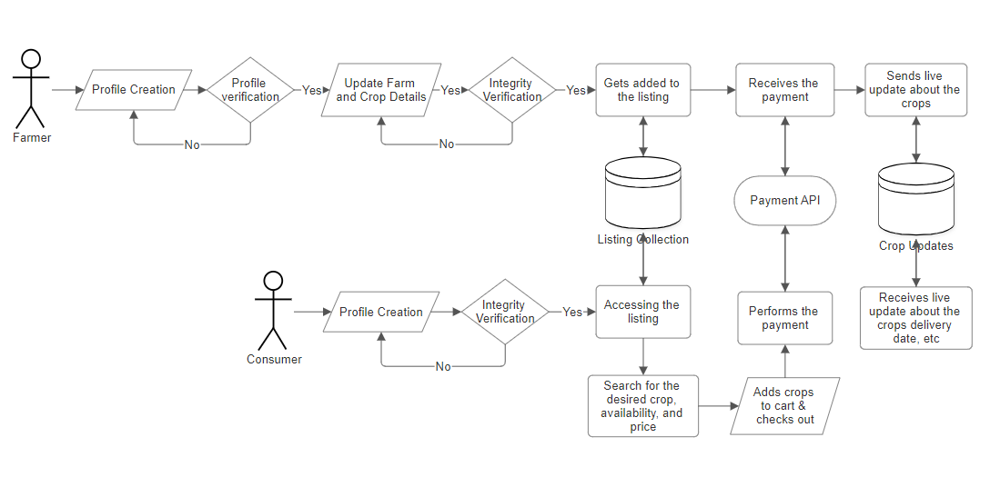
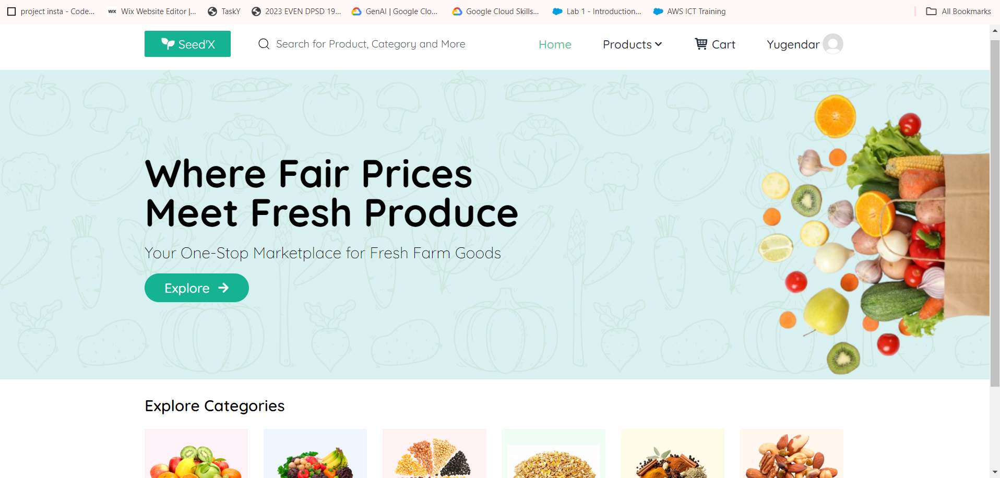
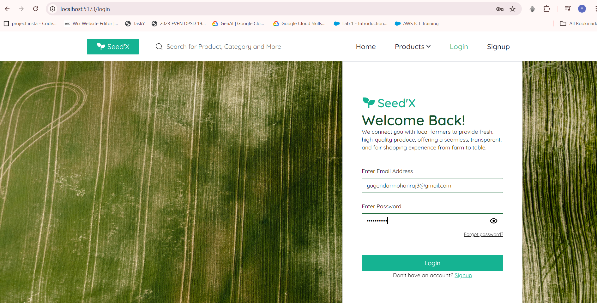
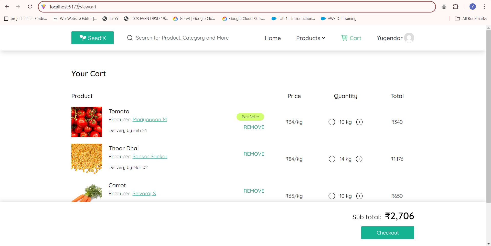
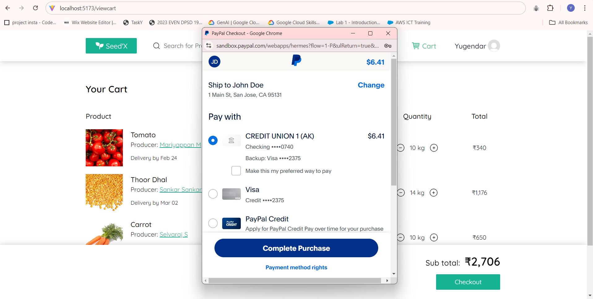

## SEED’X : PARADIGM SHIFT IN AGRICULTURAL TRADE FOR ECONOMIC PROSPERITY
Seed'X is a groundbreaking agricultural platform that integrates the concept of share market trade to connect consumers directly with farmers, revolutionizing the way we buy and consume agricultural products

## About
<!--Detailed Description about the project-->
Seed'X is a groundbreaking web application designed to transform the agricultural sector by merging the dynamics of stock exchange with the intricacies of farming. This platform seeks to empower farmers economically, eradicate the influence of middlemen, and foster a new era of transparent agricultural trade. Seed'X is not just a simulation but a fully functional tool that allows farmers to directly engage with consumers, enabling a fairer trading system. By connecting consumers and farmers without intermediaries, the platform ensures that farmers receive direct investments for their crop cultivation cycle, which in turn helps eliminate hoarding, reduces unnecessary commissions, and promotes transparency.

Through Seed'X, consumers can actively participate in agriculture by browsing and reserving their favorite products even before they are cultivated. This forward-looking approach allows users to place orders based on their preferences, revolutionizing the way agricultural products are traded and consumed. The platform introduces the concept of stock market trade into agriculture, giving farmers direct access to consumer investments, while ensuring consumers benefit from healthier, more affordable produce. Seed'X represents a disruptive innovation, aiming to establish a transparent system of trade that promotes economic independence for farmers and supports sustainable farming practices, ultimately contributing to a greener revolution.

## Features
<!--List the features of the project as shown below-->
- Enables direct investments from consumers to farmers, providing upfront capital for the entire crop cultivation process.
- Eliminates farmers' reliance on high-interest loans and exploitative agreements, promoting financial independence.
- Fosters a direct relationship between consumers and farmers, allowing consumers to invest in and track their preferred crops.
- Increases transparency by allowing consumers to follow the crop lifecycle, from planting to harvest, building trust and supporting sustainable practices.
- Reduces dependency on middlemen, allowing farmers to engage directly with consumers and avoid price manipulation.
- Provides farmers with fair compensation and consumers with fresher, more affordable produce.
- Promotes efficient, transparent, and equitable agricultural trade processes.

## Requirements
<!--List the requirements of the project as shown below-->
* Operating System: Requires a 64-bit OS (Windows 10 or Ubuntu) for compatibility with deep learning frameworks.
* Development Environment: Python 3.6 or later is necessary for coding the sign language detection system.
* Deep Learning Frameworks: TensorFlow for model training, MediaPipe for hand gesture recognition.
* Image Processing Libraries: OpenCV is essential for efficient image processing and real-time hand gesture recognition.
* Version Control: Implementation of Git for collaborative development and effective code management.
* IDE: Use of VSCode as the Integrated Development Environment for coding, debugging, and version control integration.
* Additional Dependencies: Includes scikit-learn, TensorFlow (versions 2.4.1), TensorFlow GPU, OpenCV, and Mediapipe for deep learning tasks.

## System Architecture
<!--Embed the system architecture diagram as shown below-->

## Output

<!--Embed the Output picture at respective places as shown below as shown below-->
#### Output1 - HOME PAGE

#### Output2 - LOGIN PAGE

#### Output3 - USER CART

#### Output2 - PAYMENT

## Results and Impact
<!--Give the results and impact as shown below-->
- **Financial Stability for Farmers**: Farmers receive prepayments from consumers before harvest, providing upfront capital and reducing dependence on loans or intermediaries.

- **Increased Profitability:** The dynamic pricing model allows farmers to adjust crop prices based on real-time demand, optimizing their revenue.

- **Consumer Access to Fresh Produce:** Consumers gain direct access to fresh, high-quality produce at fair prices, with the ability to track crop progress from cultivation to harvest.

- **Transparency and Trust:** Real-time updates on crop status foster transparency, strengthening the trust between farmers and consumers.

- **Sustainability:** The platform promotes sustainable farming by eliminating intermediaries, optimizing resource usage, and using eco-friendly logistics for product delivery.

## Articles published / References
1. Shuangjin Wang, Yuan Tian, Xiaowei Liu, Xiaowei Liu | “How Farmers Make Investment Decisions: Evidence from a Farmer Survey in China” | 27 December 2019

2. Gideon Danso-Abbeam1,*, Edinam Dope Setsoafia1 & Isaac Gershon Kodwo Ansah1 | “Modelling Farmers Investment in Agrochemicals: The Experience of Smallholder Cocoa Farmers in Ghana” |  October 2014 

3. Adewale Johnson Alonge, Robert A. Martin | Assessment of adoption of sustainable agricultural practices: Implications for agricultural education" | 1995 5th June.

4. Mauricio José Martínez Pérez; Aura Cecilia Pedraza Avella; Orlando E. Contreras-Pacheco |  "Challenges to the sustainability of associative new ventures: The role of impact investments in the Colombian agricultural industry" | 2017 Congreso Internacional de Innovacion y Tendencias en Ingenieria , 01 February 2018

5. A.G. Abishek; M. Bharathwaj; L. Bhagyalakshmi |  "Agriculture marketing using web and mobile based technologies" | 2016 IEEE Technological Innovations in ICT for Agriculture and Rural Development, 15-16 July 2016

6. Manisha Bhende; Mohini S. Avatade; Suvarna Patil; Pooja Mishra; Pooja Prasad; Shubham Shewalkar | "Digital Market: E-Commerce Application For Farmers" |  2018 Fourth International Conference on Computing Communication Control and Automation, 25 April 2019

7.	M.S. Minu; S. Rohit Suryaa; J. Jovan Titus; S. Sharan | "Empowering Small-Scale Farmers with Decentralized Finance (DeFi) via Ethereum Smart Contracts" | 2024 2nd International Conference on Sustainable Computing and Smart Systems , 20 August 2024

8. by Mishal Trevor Morepje ,Moses Zakhele Sithole, Nomzamo Sharon Msweli, Azikiwe Isaac Agholor |  "The Influence of E-Commerce Platforms on Sustainable Agriculture Practices among Smallholder Farmers in Sub-Saharan Africa" |  IEEE Technological Innovations in ICT for Agriculture and Rural Development, 30 July 2024

9.	Hongxia Jin; Heping Yao; Yushu Cui; Xiaoye Niu | "Optimization of Agricultural Investment Projects Based on VE and Multistage Fuzzy Comprehensive Evaluation" |  2008 4th International Conference on Wireless Communications, Networking and Mobile Computing,  October 2008

10.	Malamati Louta; Konstantina Banti; Ioanna Karampelia | "Emerging Technologies for Sustainable Agriculture: The Power of Humans and the Way Ahead" |  IEEE Access ( Volume: 12), 15 July 2024

